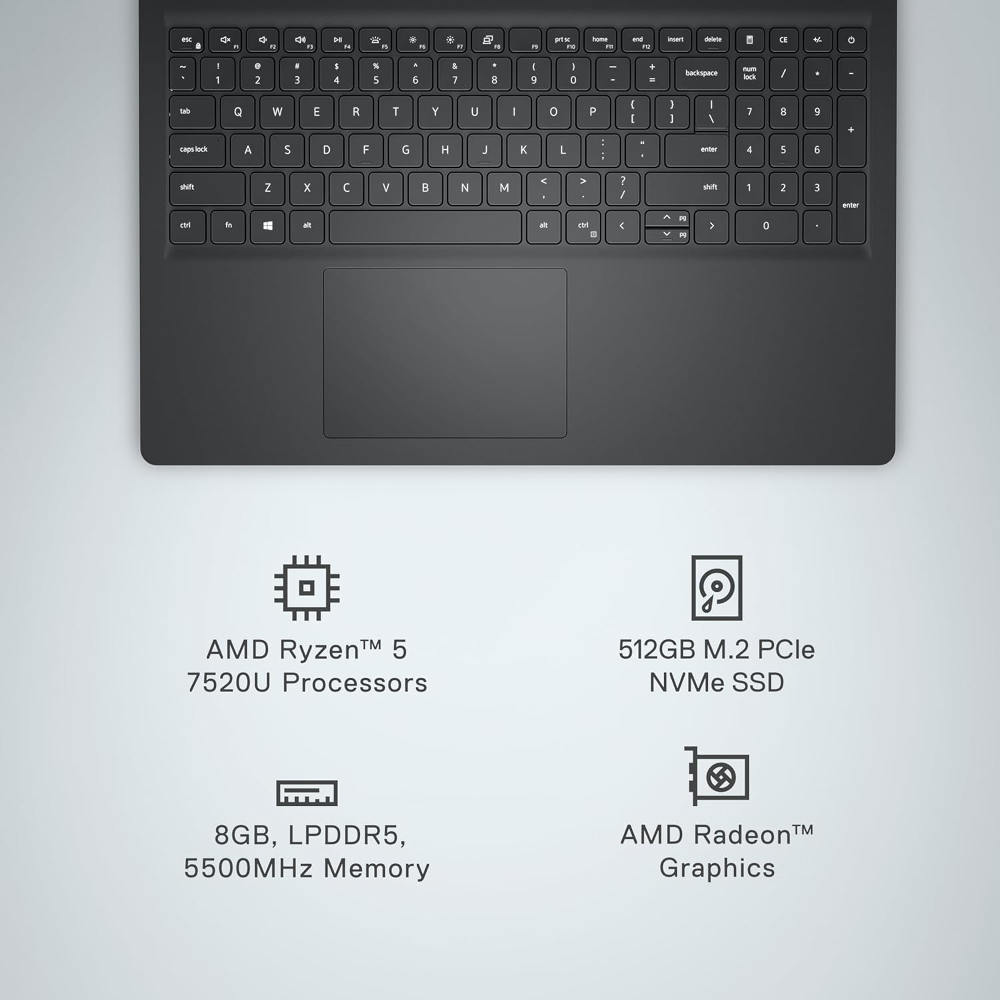

# Dell Inspiron 15 3535 — FN Key Fix for Linux Mint



[](https://buymeacoffee.com/socal370xs)
[](https://linuxmint.com/)
[](https://www.dell.com/)
[](#)
[](#)
[](#)
[](/LICENSE)

A bash script that automatically fixes non-working FN keys on the **Dell Inspiron 15 3535** running **Linux Mint**. Also detects and sets up a fingerprint reader if one is present.

---

## FN Key Map

| FN Combo | Action |
|----------|--------|
| `FN + F1` | Mute / Unmute |
| `FN + F2` | Volume Down |
| `FN + F3` | Volume Up |
| `FN + F4` | Play / Pause |
| `FN + F5` | Keyboard Backlight |
| `FN + F6` | Brightness Up |
| `FN + F7` | Brightness Down |
| `FN + F8` | External Monitor (display toggle) |

> [!NOTE]
> If any of these combos produce no response after running the script, see the **If FN Keys Still Don't Work** section below.

---

## The Problem

On Linux Mint, the Dell Inspiron 15 3535's FN keys (brightness, volume, mute, etc.) often stop working out of the box. This happens because:

- The BIOS ACPI firmware defaults to Windows behavior and routes FN key events through Windows-specific paths that Linux never receives
- The required Dell kernel modules are not loaded by default
- Some FN key scancodes are not mapped to Linux keycodes

---

## What the Script Does

| Step | Action |
|------|--------|
| 1 | Backs up `/etc/default/grub` before making any changes |
| 2 | Adds `acpi_osi=Linux`, `acpi_backlight=native`, and `pcie_aspm=off` as kernel boot parameters |
| 3 | Loads `dell-laptop`, `dell-wmi`, `dell-wmi-aio`, and `sparse-keymap` kernel modules and persists them across reboots |
| 4 | Installs `acpid`, `acpi`, and `acpi-call-dkms` if not present; enables and starts the `acpid` service |
| 5 | Installs a `udev` hwdb rule mapping all 8 FN key scancodes (mute, volume, play/pause, backlight, brightness, display toggle) |
| 6 | Detects a fingerprint reader and sets it up if found (installs `fprintd`, configures PAM, optionally enrolls your finger) |
| 7 | Runs `update-grub` to apply boot parameter changes |

---

## Requirements

- Dell Inspiron 15 3535
- Linux Mint (Ubuntu/Debian-based)
- GRUB bootloader
- Internet connection (for package installs if needed)

---

## Usage

```bash
# Clone the repo
git clone https://github.com/socalit/Dell_3535_FN_key_fix.git
cd Dell_3535_FN_key_fix

# Make the script executable
chmod +x dell-fn-fix.sh

# Run as root
sudo bash dell-fn-fix.sh
```

> [!NOTE]
> Reboot when prompted for all changes to take effect.

---

## Fingerprint Reader

The script automatically detects fingerprint readers from the following vendors:

| Vendor | Chip |
|--------|------|
| Goodix | `27c6` |
| Synaptics | `06cb` |
| AuthenTec | `08ff` |
| Validity Sensors | `138a` |
| ELAN | `04f3` |

If a reader is found, the script installs `fprintd` + `libpam-fprintd`, enables the service, configures PAM (login, sudo, lock screen), and optionally walks you through enrolling your fingerprint.

To manage fingerprints manually after setup:

```bash
fprintd-enroll                  # enroll a finger (defaults to right-index)
fprintd-enroll -f left-index    # enroll a specific finger
fprintd-list $USER              # list enrolled fingers
fprintd-delete $USER            # remove all enrolled fingers
```

---

## Recommended: Update Your BIOS First

Before running this script, make sure your BIOS is up to date. An outdated BIOS can cause FN key and ACPI issues that no Linux fix can fully work around.

| Field | Details |
|-------|---------|
| Model | Dell Inspiron 15 3535 / Vostro 3435/3535 |
| Version | **1.28.0** |
| Released | March 10, 2026 |
| Category | Critical — Security + ACPI fixes |
| File | `Inspiron_3535_1.28.0.exe` (52.18 MB) |
| Source | [Dell Support — Drivers & Downloads](https://www.dell.com/support/product-details/en-us/product/inspiron-15-3535-laptop/drivers) |

> [!CAUTION]
> Once upgraded to 1.28.0 you **cannot downgrade** to 1.23.0 or earlier. This update includes new 2023 Secure Boot Certificates and Dell Security Advisory (DSA) patches.

> [!NOTE]
> The `.exe` is Windows-only and the Inspiron 15 3535 is not listed on [LVFS](https://fwupd.org/), so `fwupd` will not work. Use one of the two Linux methods below.

---

### How to Update the BIOS from Linux Mint

**Step 1 — Download the `.exe`**

Go to [Dell Support — Drivers & Downloads](https://www.dell.com/support/product-details/en-us/product/inspiron-15-3535-laptop/drivers), filter by **BIOS**, and download `Inspiron_3535_1.28.0.exe` to `~/Downloads`.

**Step 2 — Copy the `.exe` to a FAT32 USB drive**

```bash
# Find your USB drive (e.g. /dev/sdb)
lsblk
```

> [!WARNING]
> Double-check `lsblk` before formatting. Picking the wrong drive will permanently erase all data on it.

```bash
# Format as FAT32 — replace sdX1 with your USB partition
sudo mkfs.vfat -F 32 /dev/sdX1

# Mount and copy
sudo mkdir -p /mnt/usbdrive
sudo mount /dev/sdX1 /mnt/usbdrive
sudo cp ~/Downloads/Inspiron_3535_1.28.0.exe /mnt/usbdrive/
sudo umount /mnt/usbdrive
```

**Step 3 — Flash the BIOS (choose one method)**

#### Option A — F12 One-Time Boot Menu (Recommended)

> Dell official guide: [Flashing the BIOS from the F12 One-Time Boot Menu](https://www.dell.com/support/kbdoc/en-us/000128928/flashing-the-bios-from-the-f12-one-time-boot-menu)

> [!WARNING]
> Disconnect all external devices (external drives, printers, scanners) before updating. Leave only keyboard and mouse connected.

> [!WARNING]
> Battery must be installed and charged to at least **10%**. Connect the power adapter before proceeding.

> [!CAUTION]
> **DO NOT turn off the computer during the BIOS update.** Doing so causes irreparable damage to the motherboard.

1. **Turn off** the computer completely
2. Connect the USB flash drive
3. Turn on the computer and **tap F12 repeatedly** until the One-Time Boot Menu appears
4. Use the arrow keys to select **BIOS Flash Update** and press Enter
5. Select **FS1** (the USB flash drive filesystem)
6. Click **Browse** — you may see an `EFI` folder (Ubuntu boot files), you can place `Inspiron_3535_1.28.0.exe` either at the root of the USB or inside the `EFI` folder. Navigate to where you copied it and select it
7. Click **OK** to confirm the file selection
8. Click **Begin Flash Update**
9. When the warning prompt appears, click **Yes** to start the update
10. Wait for the progress bar to complete — this can take **up to 10 minutes**
11. The laptop will automatically restart when flashing is complete


**Step 4 — Verify**

```bash
sudo dmidecode -s bios-version
# Expected output: 1.28.0
```

---

## If FN Keys Still Don't Work After Reboot

**A) Check your BIOS setting (most reliable fix for multimedia keys)**
1. Reboot and press **F2** to enter BIOS setup
2. Go to **System Configuration > Function Key Behavior**
3. Set to **Function** (not Multimedia)
4. Alternatively, press **Fn + Esc** at the login screen to toggle FN Lock

**B) Diagnose which scancodes your keyboard emits**
```bash
sudo evtest
# Select your keyboard, then press FN+F1, FN+F2, etc. and note the scancodes
```

**C) If brightness keys (FN+F6 / FN+F7) specifically don't work**

Edit `/etc/default/grub` and replace `acpi_backlight=native` with `acpi_backlight=video`, then:
```bash
sudo update-grub && sudo reboot
```

**D) Verify acpid is receiving FN key events**
```bash
acpi_listen
# Press an FN key — events should appear in the terminal
```

---

## Reverting Changes

The script backs up your GRUB config automatically:

```bash
# Find your backup
ls /etc/default/grub.bak.*

# Restore it
sudo cp /etc/default/grub.bak.YYYYMMDD_HHMMSS /etc/default/grub
sudo update-grub
```

To remove the module and udev configs:
```bash
sudo rm /etc/modules-load.d/dell-fn.conf
sudo rm /etc/udev/hwdb.d/61-dell-fn-keys.hwdb
sudo systemd-hwdb update
```

> [!NOTE]
> A reboot is required after reverting for all changes to be undone.

---

## Tested On

| Laptop | OS | Status |
|--------|----|--------|
| Dell Inspiron 15 3535 (AMD Ryzen) | Linux Mint 21.x | Working |

---

## Contributing

If this worked (or didn't) on your setup, feel free to open an issue with your kernel version and `lsusb` output. PRs welcome for other Dell Inspiron models.

---

## License

MIT

---

## Author

**SoCal IT**
Ethical hacker & Wi-Fi tools developer
GitHub: [https://github.com/socalit](https://github.com/socalit)

---

## Support

### ⭐ Star the GitHub repo
### Share it with communities
### Open issues or request features

If this project saved you time or solved a problem, consider supporting development:

[](https://buymeacoffee.com/socal370xs)
